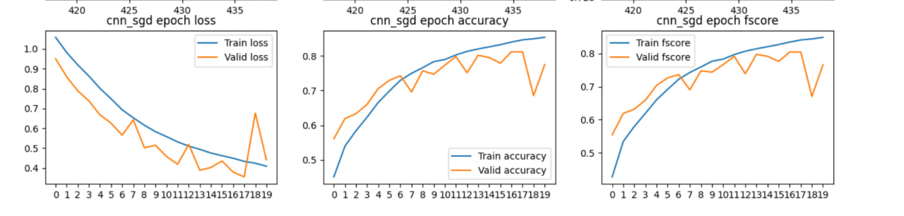
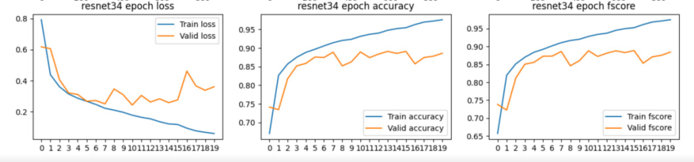
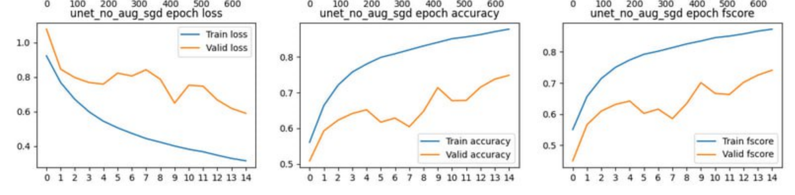
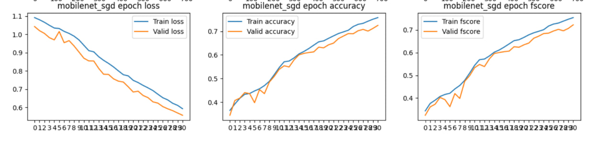
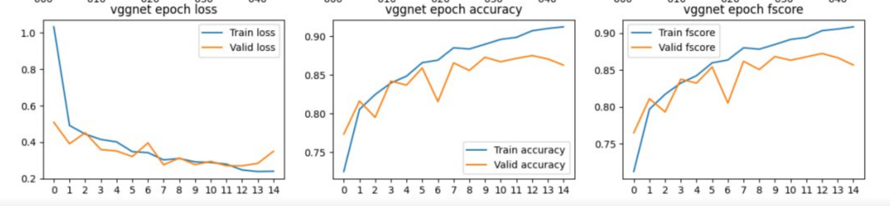
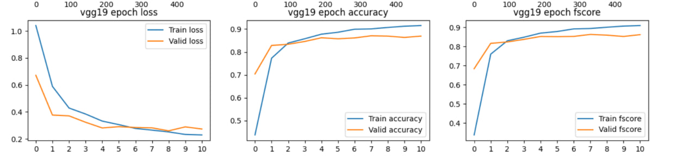
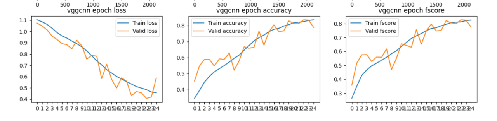

# Классификация заболеваний легких

Итоговый проект специализации по ML от Академии Яндекса.

**Краткий результат**: наш F-score равен **0.87998** (это немного, но это честная работа)

*Цель работы*: написать сверточную нейросеть для классификации рентгеновских снимков легких на три класса: 1) здоровые легкие; 2) Covid; 3) другое заболевание.

*Задачи*:
1. Написать скелет кода для теста моделей
2. Создать пайплайн обработки данных
3. Поискать научные публикации на тему проекта
4. Из найденных публикаций выбрать модели, которые необходимо реализовать
5. Реализовать модели и опредеить среди них лучшую  

## Структура проекта

Проект разделен на ряд папок, каждая из которых отвечает за какую-либо смысловую часть проекта.

`core` - в этой папке находятся все файлы, отвечающие за скелет для теста моделей:

`core/architecrue.py` - функции для непосредственного теста модели: прохождение эпохи обучения/валидации, сохранение/загрузка состояняи модели, получение метрик

`core/custom_dataset.py` - класс датасета, который используется при обучении моделей. Может как иметь файл с предсказанными классами (нужно для обучения), так и не иметь его (когда нужно получить ответы на test). Класс имеет метод для *аугментации* изображений, параметры для которой преедаются при инициализации объекта класса

`core/graph_functions.py` - несколько функций для отрисовки графиков обучения (они будут ниже)

`core/preprocessing.py` - функции для аугментации train и test датасета. В отличие от метода в классе кастомного датасета, эти методы аугментации применяются случайно, а в кастомном датасете - на все изображения (например, увеличение четкости у всех изображений)


`graphs` - папка с графиками обучения моделей. На каждом графике содержатся подграфики по loss, accuracy и fscore для трейновой и тестовой выборки


`model_states` - папка с сохраненными состояниями моделей (весы и номер эпохи)


`models` - папка с моделями. О них будет написано ниже


`outputs` - папка с csv-файлами с предсказаниями на test


`scripts` - папка со скриптами для работы с проектом

`scripts/argument_parser.py` - класс парсера аргументов командной строки, которые преедаются для настройки параметров обучения

`scripts/creating_dataset.py` - скрипт для загрузки датсета и разделения train изображений на train, используемый при обучении, и test, используемый для отслеживания сходимости модели

`scripts/merge_predicts.py` - скрипт для слияния предсказаний нескольких моделей из csv (т.е. ансамбль моделей, если его можно так назвать)

`scripts/predict_classes.py` - скрипт для предсказания ответов на test при использовании конкретной модели и конкретного файла состояния

`scripts/training.py` - скрипт для непосредсвеного обучения модели

## Пайплайн

Пайплайн в проекте реализован с помощью скриптов (т.е. мы не пользуемся jupyter notebook). Причина - централизация, то есть. имея один источник (репозиторий), можно использовать актуальный код с помощью одних и тех же команд как локально, так в google colab, kaggle или при испорльзовании сервера (сервер мы использовать не стали, хотя хотели)

### 0. Подготовка к использованию

(здесь и далее приведены команды для Linux, для Windows надо чуть поменять)

```bash
pip install opendatasets
git clone https://github.com/staffeev/lungs_issues_ml.git
cd lungs_issues_ml
```

Для подготовки надо скачать kaggle'овскую библиотеку, склонировать сам репозиторий и перейти в него.

### 1. Создание датасета

```bash
python3 scripts/creating_dataset.py --train_size 0.95 --download
```

Для создания датасета в папке проекта должен лежать файл `kaggle.json`, в котором лежит API-ключ Kaggle. При запуске команды мжно указать два необязательных флага: `--download` (скачивать датасет или нет (вторая опция нужн для теста), по умолчанию - нет) и `--train_size` (доля тех изображения из train, которые останутся в train и будут использованы для обучения; по умолчанию 0.9). 

Так как ответов на изображения из test у нас нет (их надо получить), то для оценки сходимости моделей часть изображений из train мы не будем использовать для обучения, но будем по ним смотреть сходимость (ведь для них существуют уже ответы)

После работы скрипта в папке проекта будет находиться папка `dataset/data` с папками `train_images`, `test_images` (понятно, что там) и файлами `train_labels.csv` (имена файлов тех изображений из train, которые *и останутся* в train) и `test_labels.csv` (имена файлов изображений из train, которые будут использованы в качестве test)

### 2. Обучение модели

```bash
python3 -m scripts.training models/vgg19.py --model_title vgg19 --save_graph --save_state --num_epochs 20 --batch_size....
```

Скрипт выполняет обучение модели, которая передается первым аргументом. Это путь в файлу `.py`, в котором должен находиться класс модели. **Важно**: код берет из файла первый класс, который начинается с большой буквы, поэтому желательно аддитивные классы называть не с большой буквы, иначе код может пытаться брать не тот класс для обучения.

Скрипт принимет большое количество необязательных параметров в двух условных группах:

Группа для обучения:

`--model_title` - имя модели, которое 1) будет на графиках 2) под которым буду сохраняться графики и состояния моделей (по умолчанию - model)

`--optimiser` - оптимизатор. Необходимо называть так же, как он назван в pytorch (по умолчанию - Adam)

`--loss_func` - функция потерь. Название такое же, как в pytorch (по умолчанию - CrossEntropyLoss)

`--batch_size` - размер батча (по умолчанию - 64)

`--num_epochs` - количество эпох для обучения (по умолчанию - 3)

`--save_graph` - если присутствует, будут сохраняться графики обучения (по умолчанию - нет)

`--save_state` - если присутствует, будут сохраняться состояния моделей в формате `<имя модели>_<номер эпохи>.pt`

`--load_state` - продолжить обучение с использованием весов из переданного файла (указывается без папки `model_states` и расширения `.pt`)

`--period_save_weights` - раз в сколько эпох сохранять веса модели (по умолчнию - 1)


Группа аугментации:

`--equalize` - "нормировка" засветов и затменений изображения (если передан)

`--brightness` - во сколько раз увеличить яркость

`--contrast` - во сколько раз увеличить контрастность

`--sharpness` -  во сколько раз увеличить четкость

`--grayscale` - если передан, изображение становится черно-белым

`--horflip` - вероятность отражение по горизонтали

`--rotate` - угол поворота изображения

`--resize` - изменения размера изображения до `AxA`

`--invert` - если передан, цвета интервируются


После выполнения работы скрипта в папке `graphs` будет график обучения модели, в папке `model_state` - веса моделей

### 3. Получение предсказаний

```bash
python3 -m scripts.predict_classes models/vgg19.py --weights vgg19_20 --save_path outputs/vgg19.csv
```

Первым аргументом указывается путь к модели (так же, как в скрипте для обучения). Флаг `--weight` указывает название файла с весами (без папки `model_states` и `.pt`). Флаг `--save_path` указывает путь к файлу, куда будут сохранены предсказания.

После выполнения скрипта по указанному пути будет находиться csv с предсказаниями.

### 4*. Объединение предсказаний

Необязательный пункт. В целях повышения точности можно попробовать объединить результаты предсказаний нескольких моделей (берется мода)

```shell
python3 -m scripts.merge_predicts <имя 1> <имя 2>...
```
Указываются имена файлов в папке `outputs` (без расширения), которые нужно обхединить. Результат сохраняется в `outputs/merged.csv`


## Модели

Везде использована функция потерь CrossEntropyLoss

### CNN

Модель в `models/simple_cnn.py`

График обучения:


Модель после 16 эпохи стала переобучаться.

Fscore для нее - **0.77400**

### ResNet34 ([paper](https://arxiv.org/pdf/1512.03385.pdf))

Модель в `models/resnet.py`

График обучения:



Модель переобучилась после 5 эпохи

Fscore для нее - **0.75596**

### Unet ([paper](https://arxiv.org/pdf/1505.04597.pdf))

Модель в `models/unet.py`

График обучения:



Модель ведет себя очень странно. Вероятно, потому что Unet больше предназначен для сегментации, чем для классификации. Для масок можно было бы использовать Unet, но мы не успели

Fscore для нее - **0.81051**

### MobileNetV2 ([paper](https://arxiv.org/pdf/1801.04381.pdf))

Модель в `models/mobilenet.py`

График обучения:



Видно, что модель отлично справляет с переобучением (плюс обучение шло намного быстрее). Однако почему-то на test она выдала очень плохой результат (худший из всех)

Fscore для нее - **0.17563**


### VGG ([paper](https://www.sciencedirect.com/science/article/pii/S1110016822007104?ref=pdf_download&fr=RR-3&rr=8797c5ab0d829d74))

модели в `models/vgg16.py` и `models/vgg19.py`. В реализации этих моделей было использовано большое количество skip-connection, что помогло справиться с переобучением и показать хороший (по сравнению с другими нашими моделями) fscore

Графики обучения для VGG16:



Fscore для нее - **0.86404**

Графики обучения для VGG19:



Fscore для нее - **0.87600**


### VGG + CNN ([paper](https://www.sciencedirect.com/science/article/pii/S1110016822007104?ref=pdf_download&fr=RR-3&rr=8797c5ab0d829d74))

Модель в `models/vggcnn.py`. Это комбинация VGG19 и CNN (слои CNN идет сразу после слоев VGG19). В статье эта комбанция дала лучший результат среди опробованных моделей.

График обучения:



Как можно заметить, модель себя ведет странно. Возможно, модель делает попытки к переобучению на слоях CNN (там мало использовано средств для борьб с этим, в отличие от слоев VGG19)

Fscore для нее - **0.79557**


### Пример ансамбля моделей

Были объединены результаты для моделей Resnet34 еез аугментации (**0.75596**), VGG16 с аугментацией (**0.85280**), VGG16 без аугментации (**0.86404**), VGGCNN без аугментации (**0.79557**) и VGG19 без аугментации (**0.87600**)

Итоговый Fscore - **0.87998** (лучший из всех наших результатов)


## Итоги

По итогам работы был создан единый пайплайн для работы с моделями, обладающей гибкостью в выборе параметров и подходящий для нескольких устройств (локалка, kaggle, colab). Мы считаем это преимуществом нашего проекта

Для получения предсказаний были использованы модели CNN, Unet, VGG16, VGG19, VGGCNN, MobileNet, ResNet. Стоит отметить, что сделанная нами аугментация тлько ухудшала результаты всех моделей (причина нам не ясна). В качестве функции потерь мы везде использовали CrossEntropyLoss, в качестве оптимизатора - SGD или Adam (разница между ними, за исключением времени, была совсем незаметная, поэтому в этой записке нигде не упоминается, какой именно оптимизатор использован)

Лучший результат показала модель VGG19 с fscrore **0.87600**. Вероятно, если бы мы написали еще сколько-то слоев, то модель дала бы еше лучше результат. Благодаря куче skip-connection она сходится. Ансамбль моделей помог улучшить этот результат до **0.87998**. Результат, конечно, не высокий, но мы очень старались.


